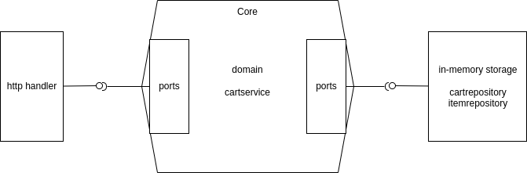

# Shopping cart service 🛒

## Architecture

I choose the **hexagonal (ports and adapters)** for the architecture because It provides isolation between layers, keeping the domain and service core with no dependencies besides the business logic.


```
├── cmd                                 // entry points
└── internal   
├── config                              // load app configs          
    ├── core                            
    │   ├── domain                      // business domain entities
    │   ├── ports                       // services and repository interfaces
    │   ├── services
    │   │   └── cartservice
    ├── handlers                        // requests handlers
    ├── infra                               
    |   └── server                      // http server
    ├── repositories                    // database in-memory 
    |   ├── cartrepository
    └── └── itemrepository
```


## Data seed

The app starts with the data below pre-loaded:

```
Items
| Item_id | Name    | Price (USD) |
|---------|---------|-------------|
| 10      | T-shirt | 12.99       |
| 20      | Jeans   | 25.00       |
| 30      | Dress   | 20.65       |
```

```
Carts(User)
User ID: bba82f7a-caa1-4587-819b-6db46e14fc60 
```

## Limitation

### Context and Transaction
For simplicity, the app has no shared transaction isolated context.

### Scalability 
The app uses in-memory storage, so It's not able to horizontal scale out of the box.

## Commands

Requirements:
- Docker
- Docker-compose

### Run tests in docker
```
$ docker build --target test -t shopping-cart . &&
docker run -t -i --rm \
	-v .:/usr/app:delegated \
		--name shopping-cart-test \
		shopping-cart \
		go clean --testcache && \
		go test -cover ./...
```

### Start app
```
$ cp .env.sample .env && docker-compose up
```

## Endpoints use cases

There's only one user cart pre-loaded, so all requests must include the header  --header 'user_id: bba82f7a-caa1-4587-819b-6db46e14fc60'

### Get shopping cart
```curl
curl --location 'http://localhost:8080/shopping-carts' \
--header 'user_id: bba82f7a-caa1-4587-819b-6db46e14fc60'
```

### Add item to shopping cart
- quantity param is optional
```curl
curl --location --request POST 'http://localhost:8080/shopping-carts/items?item_id=20&quantity=3' \
--header 'user_id: bba82f7a-caa1-4587-819b-6db46e14fc60'
```

### Remove item to shopping cart
```curl
curl --location --request DELETE 'http://localhost:8080/shopping-carts/items/10' \
--header 'user_id: bba82f7a-caa1-4587-819b-6db46e14fc60'
```

